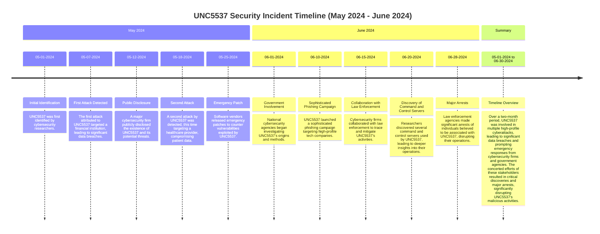

## Understanding the Threat Landscape: UNC5537's Notorious Cyber Attacks

In recent months, the cyber threat landscape has been significantly impacted by the activities of UNC5537, a financially motivated cyber threat group. This article delves into the significant attacks and threats posed by UNC5537, providing a detailed analysis that is both informative and accessible to a tech-savvy audience.

### Attack Description

UNC5537 has been systematically targeting Snowflake customer database instances to conduct data theft and extortion. Utilizing stolen customer credentials, this group gains unauthorized access to databases, exfiltrates sensitive data, and subsequently threatens to leak or sell the data if ransom demands are unmet.

### Tactics, Techniques, and Procedures (TTPs)

- Initial Access: Using stolen credentials to access Snowflake customer databases.

- Execution: Deploying tools to exfiltrate data from compromised databases.

- Persistence: Maintaining access through legitimate credentials and potential backdoors.

- Exfiltration: Transferring stolen data to external servers controlled by UNC5537.

- Extortion: Issuing ransom demands to affected organizations, threatening to leak or sell the data.

### Actors

UNC5537 operates within a larger community of threat actors who collaborate on various platforms, including websites, Telegram, and Discord servers. While the exact structure of UNC5537 remains undisclosed, their operations indicate a well-coordinated and resourceful group.

### Victims

The primary victims are customers of Snowflake, a cloud-based data warehousing company. Reports suggest up to 165 customers have been affected by these attacks, resulting in significant data theft and subsequent extortion attempts.

### Timeline from the Previous Task

### Impact

The impact of UNC5537's attacks includes substantial data breaches, financial losses from extortion payments, and reputational damage to the affected organizations. The stolen data often contains sensitive information, which, if disclosed, could lead to further security and privacy issues.

### Recommendations

To mitigate the threat posed by groups like UNC5537, organizations should consider the following recommendations:

- Enhance Security Posture: Regularly update and patch systems to protect against known vulnerabilities.

- Implement Strong Authentication: Use multi-factor authentication (MFA) to protect access to sensitive systems and data.

- Monitor for Suspicious Activity: Employ advanced threat detection and monitoring solutions to identify and respond to potential intrusions.

- Conduct Employee Training: Regularly train employees on the latest phishing and social engineering tactics to reduce the risk of credential theft.

- Collaborate with Authorities: Work closely with cybersecurity firms and law enforcement agencies to stay informed about emerging threats and coordinated response efforts.

In conclusion, the activities of UNC5537 underscore the critical need for robust cybersecurity measures. By understanding their tactics and impact, organizations can better prepare and defend against such threats, safeguarding their data and reputation in an increasingly hostile digital landscape.
